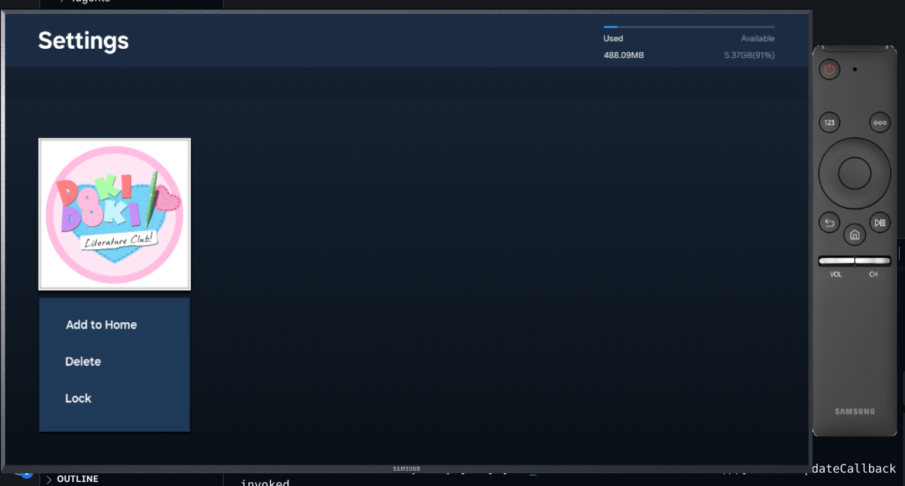
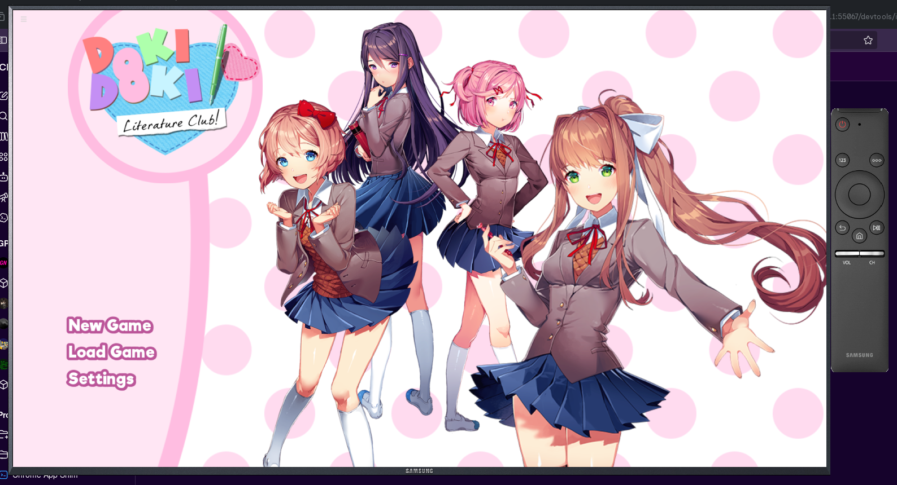

# DDLC4Tizen
An unofficial port of the 2017 visual novel *Doki Doki Literature Club!* for Samsung's Tizen based Smart TVs. 

This is an **unoffical port** of DDLC. We are not affiliated or associated with Team Salvato in any way. I recommend that you check out the official game at [https://ddlc.moe](https://ddlc.moe)

## Screenshots

## How?!
RenPy can export visual novels to HTML5, allowing them to be played in modern web browsers. All you really need to do to get RenPy running in a Tizen application is to copy the web dists into the projects and modify `renpy-pre.js` to remove a check for the `file://` domain and a broken service worker. 

## Placing assets
You will need to pull assets from your own copy of Doki Doki Literature Club, as they are not included for legal reasons. 

### Adding the assets to the RenPy project
A copy of the modified RenPy project is located at `renpy/DDLC4Tizen-noip`. You will need to copy this into where your RenPy projects are stored.

The missing paths are:
* `game/bgm` - Background music
* `game/sfx` - Sound effects
* `game/gui` - GUI assets
* `game/images` - Image assets

Once you copied over the files, you can build the project for HTML5. 

Once you have the project, copy ONLY the `game/` and `game.zip` files to the repo where DDLC4Tizen is located.
